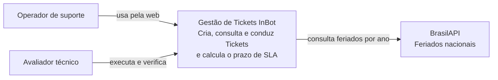
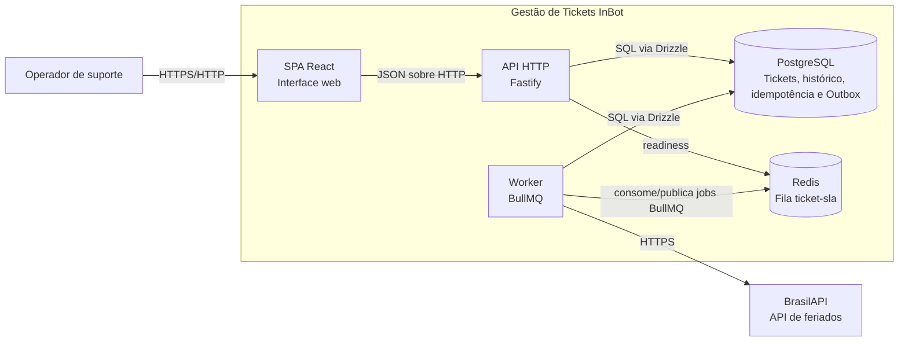
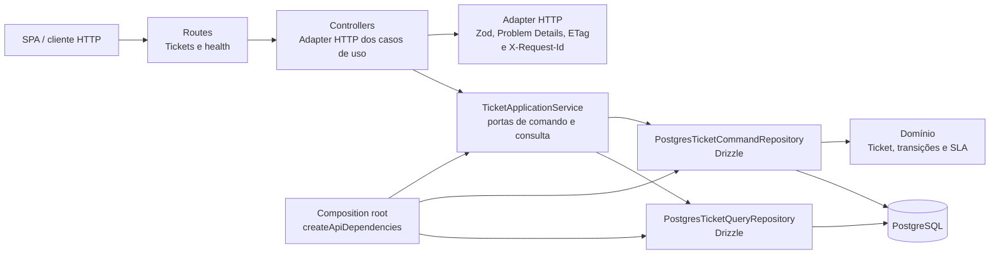
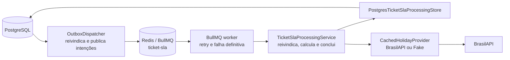

# Arquitetura C4 — Gestão de Tickets InBot

**Público:** pessoas desenvolvedoras, avaliadores técnicos e quem opera o ambiente local.

Este documento usa os níveis Contexto, Contêiner e Componente do modelo C4.
Ele descreve a estrutura que está em execução, não uma arquitetura futura. Os
fluxos de execução, dados e implantação foram separados para não sobrecarregar
os diagramas estruturais:

- [Fluxos de execução](runtime-flows.md)
- [Dados e invariantes](data-and-invariants.md)
- [Implantação e operação local](deployment.md)

## Escopo e decisões

- O sistema é um **monólito modular TypeScript** no monorepo. API e Worker são
  dois processos implantáveis que compartilham domínio e casos de uso.
- PostgreSQL é a fonte de verdade. Redis transporta jobs BullMQ; não contém o
  estado de negócio definitivo.
- A publicação assíncrona usa Transactional Outbox: a requisição HTTP não
  depende de publicar na fila nem de consultar a BrasilAPI.
- A API não possui autenticação ou autorização nesta entrega. Este documento
  não deve ser interpretado como desenho para exposição pública.

## Nível 1 — Contexto do sistema

O Operador de suporte cadastra, consulta e conduz Tickets. O Avaliador técnico
executa o ambiente e verifica os cenários. A BrasilAPI é uma dependência
externa usada somente pelo processamento assíncrono do SLA.

## Nível 2 — Contêineres

| Contêiner  | Responsabilidade                                                                        | Tecnologia          |
| ---------- | --------------------------------------------------------------------------------------- | ------------------- |
| SPA React  | Formulário, lista, detalhe e polling enquanto há processamento pendente.                | React, Vite         |
| API HTTP   | Valida transporte, expõe Tickets e health checks, converte erros em Problem Details.    | Fastify, Zod        |
| Worker     | Publica a Outbox, consome jobs, consulta feriados e calcula/persiste o SLA.             | BullMQ, Node.js     |
| PostgreSQL | Fonte de verdade: Ticket, histórico imutável, chave de idempotência e mensagens Outbox. | PostgreSQL, Drizzle |
| Redis      | Mantém a fila `ticket-sla`, tentativas e backoff.                                       | Redis, BullMQ       |

API e Worker compartilham o mesmo banco e o pacote de domínio, mas não se
chamam diretamente. O contêiner de migração, portas, volumes e health checks
estão no [diagrama de implantação](deployment.md).

## Nível 3 — Componentes da API HTTP

| Componente                        | Responsabilidade                                                                | Principais portas/dependências                      |
| --------------------------------- | ------------------------------------------------------------------------------- | --------------------------------------------------- |
| `api/routes/*`                    | Registra método, caminho e delegação ao controller.                             | `TicketController`, `HealthController`              |
| `api/controllers/*`               | Valida entrada HTTP, chama casos de uso e monta status, headers e payloads.     | `TicketUseCases`, Fastify, `api/http/*`             |
| `api/http/*`                      | Serializa Ticket, calcula ETag e converte falhas em `application/problem+json`. | Fastify                                             |
| `api/dependencies.ts`             | Composition root que escolhe e conecta adaptadores concretos.                   | `TicketApplicationService`, PostgreSQL              |
| `TicketApplicationService`        | Entrada da aplicação; gera IDs e coordena portas de comando e consulta.         | `TicketCommandRepository`, `TicketQueryRepository`  |
| `domain/*`                        | Regras puras de transição de status, mudança de prioridade e cálculo de SLA.    | Nenhuma dependência de transporte ou infraestrutura |
| `PostgresTicketCommandRepository` | Transações de criação/mutação, idempotência, histórico e intenção Outbox.       | Drizzle/PostgreSQL                                  |
| `PostgresTicketQueryRepository`   | Consultas paginadas, filtros de SLA e detalhe/histórico.                        | Drizzle/PostgreSQL                                  |

As rotas não contêm tradução HTTP nem lógica de aplicação, controllers não
importam infraestrutura diretamente e domínio/aplicação não importam contratos
compartilhados de transporte; esses limites são verificados por
`backend/src/architecture-boundaries.test.ts`. O fluxo entre esses componentes
está em [Fluxos de execução](runtime-flows.md).

## Nível 3 — Componentes do Worker

O `OutboxDispatcher` usa uma concessão com `FOR UPDATE SKIP LOCKED` para
publicar somente intenções persistidas. O job contém apenas `ticketId` e
`processingVersion`, tem ID determinístico
`ticket-{ticketId}-processing-{processingVersion}` e pode ser entregue mais de
uma vez. O Worker aceita entrega repetida porque reivindica e conclui apenas a
versão atual do Ticket.

## Limites explícitos

- O cache de feriados está em memória por processo; não é compartilhado entre
  réplicas e se perde ao reiniciar.
- Readiness exige PostgreSQL e Redis; a BrasilAPI não bloqueia a API.
- Não há autenticação, autorização, TLS de produção, notificações em tempo real
  ou observabilidade centralizada.

## Rastreabilidade

- Código: `backend/src/api`, `backend/src/application`, `backend/src/domain`,
  `backend/src/infrastructure` e `backend/src/worker/main.ts`.
