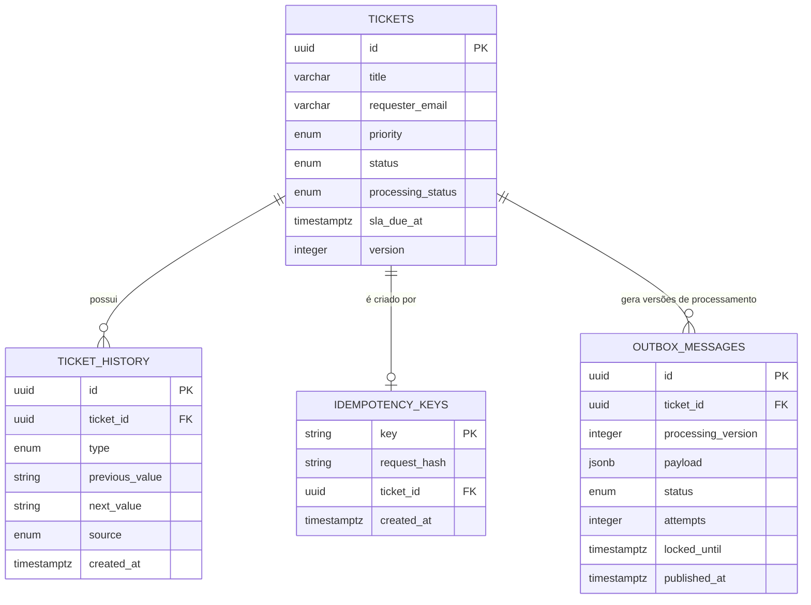
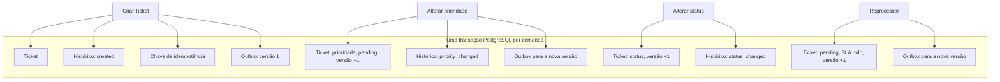

# Dados e invariantes — Gestão de Tickets InBot

**Público:** pessoas desenvolvedoras e avaliadores técnicos.

PostgreSQL é a fonte de verdade do sistema. Redis/BullMQ transporta trabalho;
não é a autoridade sobre Tickets, histórico ou idempotência. O schema Drizzle e
as migrations SQL são a fonte de verdade de colunas e índices:

- `backend/src/infrastructure/database/schema.ts`
- `backend/drizzle/0000_initial_ticket_persistence.sql`

## Modelo de dados

`description`, datas de criação/atualização e outros campos de transporte foram
omitidos do desenho para destacar relacionamentos e proteções. O modelo não
armazena payload pessoal no job: a Outbox contém `ticketId` e
`processingVersion`.

## Invariantes e mecanismo que os protege

| Invariante                                                                     | Mecanismo efetivo                                                                 | Evidência de implementação         |
| ------------------------------------------------------------------------------ | --------------------------------------------------------------------------------- | ---------------------------------- |
| Um Ticket novo não fica sem intenção persistida de SLA.                        | Uma transação grava Ticket, histórico de criação, chave de idempotência e Outbox. | `createTicketWithProcessingIntent` |
| Uma chave de idempotência representa apenas um payload.                        | `idempotency_keys.key` é chave primária; hash canônico diferencia reuso inválido. | `IdempotencyKeyReusedError`        |
| Uma chave não cria dois Tickets.                                               | Índice único em `idempotency_keys.ticket_id`.                                     | migration inicial                  |
| Histórico não é alterável ou removível.                                        | Trigger PostgreSQL rejeita `UPDATE` e `DELETE` em `ticket_history`.               | `ticket_history_is_immutable`      |
| Uma alteração não sobrescreve versão concorrente.                              | `UPDATE` condicional por `id` e `version`; falha vira `412`.                      | `TicketVersionConflictError`       |
| Uma versão de Ticket recebe no máximo uma intenção Outbox.                     | Índice único em `(ticket_id, processing_version)`.                                | migration inicial                  |
| Duas instâncias do Dispatcher não reivindicam a mesma mensagem ao mesmo tempo. | `FOR UPDATE SKIP LOCKED` e lease em `locked_until`.                               | `OutboxDispatcher.claimBatch`      |
| Um job repetido não recalcula versão ultrapassada ou já concluída.             | `claim` condicional por Ticket, versão e status de processamento.                 | `PostgresTicketSlaProcessingStore` |

## Transações que mudam o agregado

`GET /tickets` e `GET /tickets/{id}` não mudam o agregado. O Worker atualiza
apenas `processingStatus`, `slaDueAt` e `updatedAt` para a versão que conseguiu
reivindicar; ele não acrescenta histórico de negócio.

## Índices e caminhos de consulta

| Consulta ou operação          | Proteção/índice                                                       |
| ----------------------------- | --------------------------------------------------------------------- |
| Lista por status e prioridade | `tickets_status_priority_idx`                                         |
| Ordenação estável da lista    | `tickets_created_at_id_idx` em `created_at DESC, id DESC`             |
| Histórico do detalhe          | `ticket_history_ticket_created_at_idx` em `ticket_id, created_at ASC` |
| Dispatcher                    | índice parcial de Outbox pendente por `status, created_at`            |
| Idempotência                  | chave primária de `idempotency_keys.key`                              |

## Limites explícitos

- A transação PostgreSQL não inclui Redis. A garantia é intenção persistida,
  não uma transação distribuída nem entrega exatamente uma vez.
- A chave de idempotência não é uma autorização nem identifica o operador.
- Não existe retenção automática documentada para Outbox, jobs BullMQ ou chaves
  de idempotência; isso é uma evolução operacional para uma carga real.
- O histórico tem imutabilidade no banco, mas não é auditoria nominal: não há
  autenticação implementada para provar quem é o operador.
