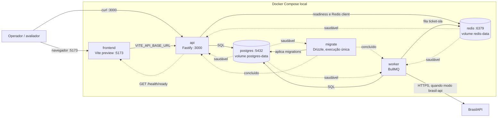
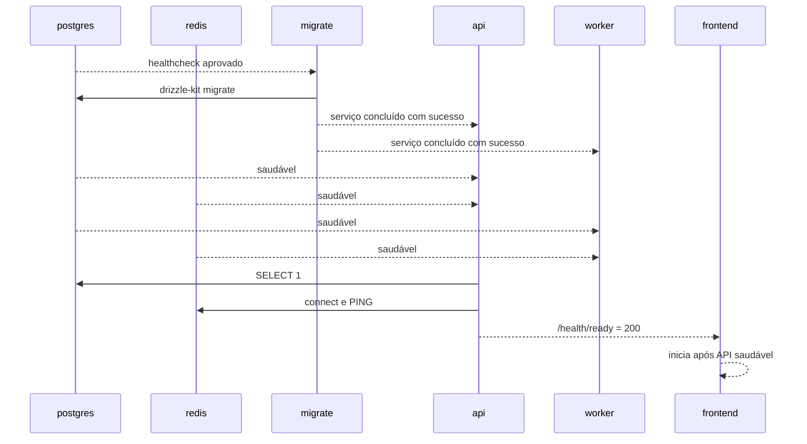
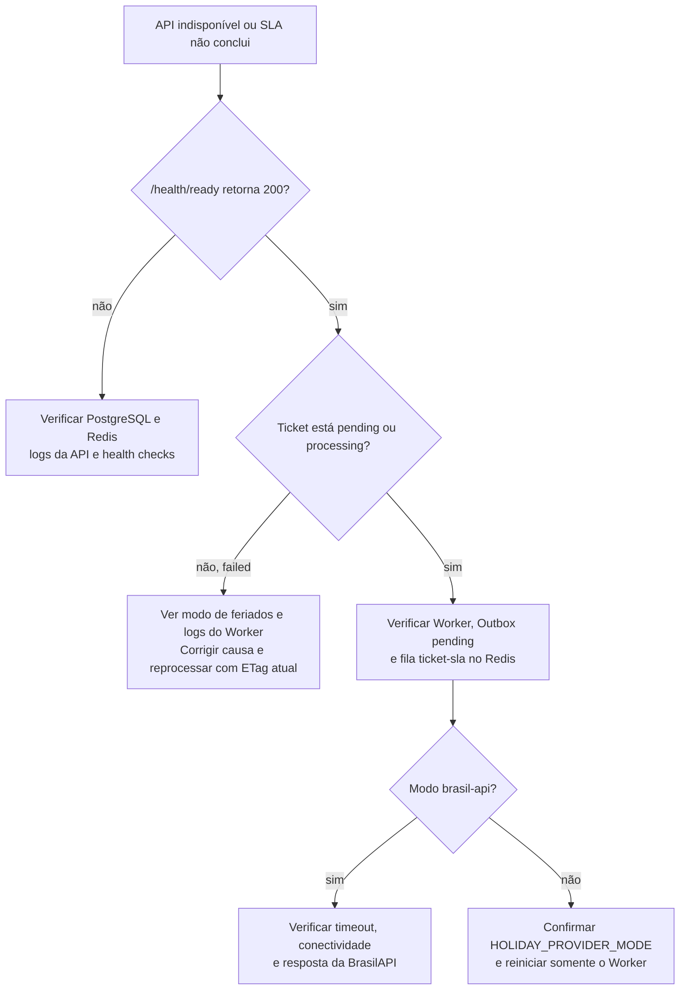

# Implantação e operação local — Gestão de Tickets InBot

**Público:** pessoas que executam, demonstram ou diagnosticam o ambiente local.

Este é um diagrama de implantação local, não uma topologia de produção. Ele
descreve o Docker Compose que sobe PostgreSQL, Redis, migrations, API, Worker e
Frontend.

## Topologia Docker Compose

| Serviço    | Porta publicada | Estado de saúde                         | Papel                                                              |
| ---------- | --------------: | --------------------------------------- | ------------------------------------------------------------------ |
| `frontend` |            5173 | `fetch http://localhost:5173`           | Entrega a SPA compilada.                                           |
| `api`      |            3000 | `GET /health/ready`                     | Expõe API HTTP; só fica pronta com PostgreSQL e Redis disponíveis. |
| `worker`   |   não publicada | Não há health check próprio no Compose. | Publica Outbox e processa SLA.                                     |
| `migrate`  |   não publicada | Execução única bem-sucedida.            | Aplica migrations antes de API e Worker.                           |
| `postgres` |            5432 | `pg_isready`                            | Fonte de verdade, persistida em `postgres-data`.                   |
| `redis`    |            6379 | `redis-cli ping`                        | Fila BullMQ, persistida em `redis-data`.                           |

As portas de PostgreSQL e Redis são publicadas para desenvolvimento local. Isso
não é uma política de rede para produção.

## Ordem de partida e prontidão

`GET /health/live` apenas confirma que o processo HTTP responde. `GET
/health/ready` verifica PostgreSQL e Redis; a BrasilAPI não bloqueia readiness,
pois ela é consumida pelo Worker no momento do cálculo.

## Configuração por processo

| Grupo         | API                                                     | Worker                                       |
| ------------- | ------------------------------------------------------- | -------------------------------------------- |
| Conexões      | `DATABASE_URL`, `REDIS_URL`                             | `DATABASE_URL`, `REDIS_URL`                  |
| HTTP          | `API_PORT`, `CORS_ORIGIN`, limite de corpo e rate limit | Não se aplica                                |
| Outbox e fila | Não se aplica                                           | intervalo, lote, lease, tentativas e backoff |
| Feriados      | Não se aplica                                           | modo, timeout e TTL de cache                 |

`HOLIDAY_PROVIDER_MODE=brasil-api` usa o provedor real. Os modos `success`,
`timeout`, `429`, `500` e `400` tornam demonstrações e testes de falha
reproduzíveis sem depender da internet.

## Fluxo de diagnóstico

## Limites operacionais conhecidos

- O Compose não configura TLS, balanceador, rede privada, secret manager ou
  alta disponibilidade.
- O Worker não tem endpoint HTTP nem health check próprio no Compose; logs e o
  estado observável do Ticket são a evidência atual de processamento.
- O cache de feriados é local à instância do Worker.
- Para um cenário de carga real, o plano é medir antes de adicionar réplicas,
  cache distribuído ou serviços gerenciados.
