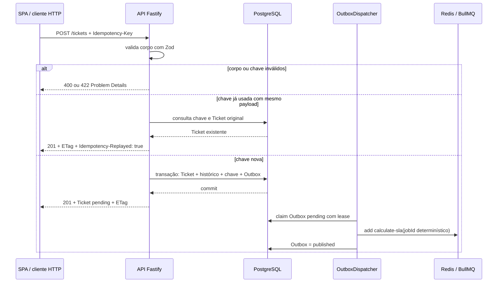
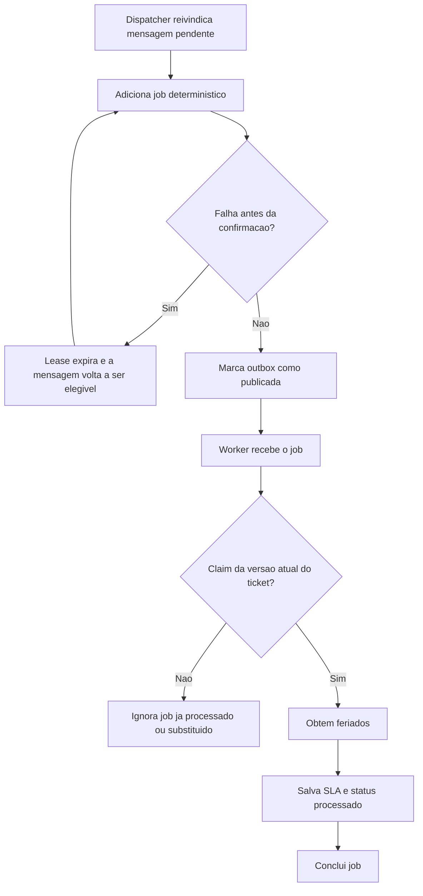
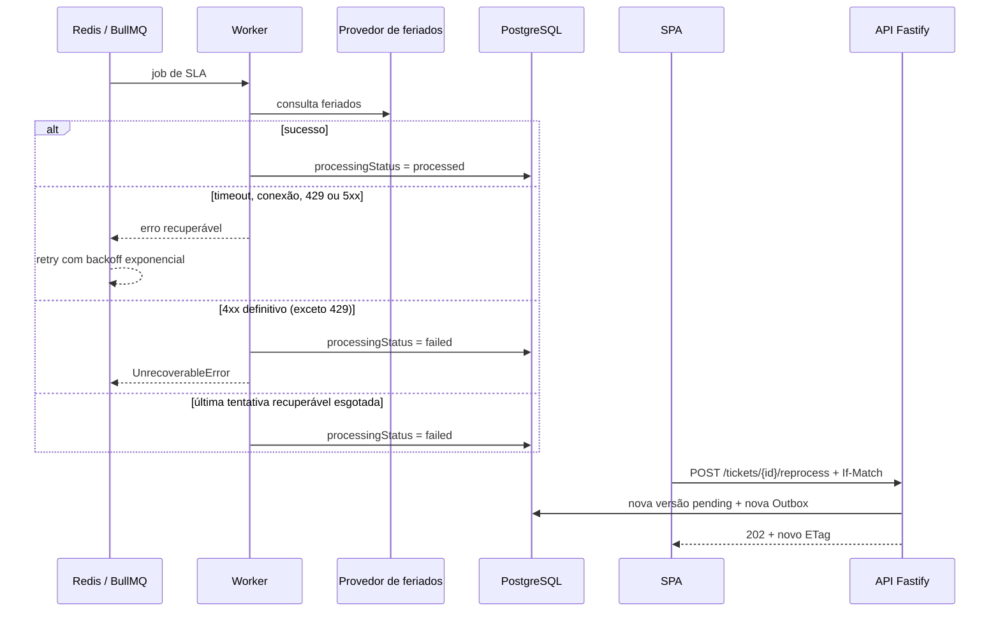
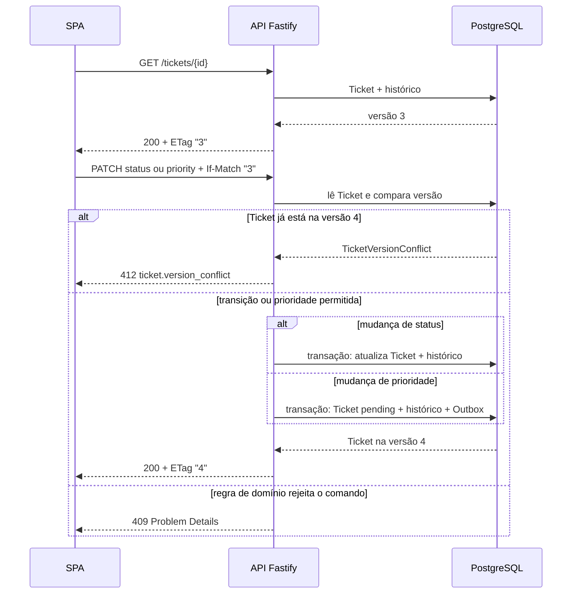
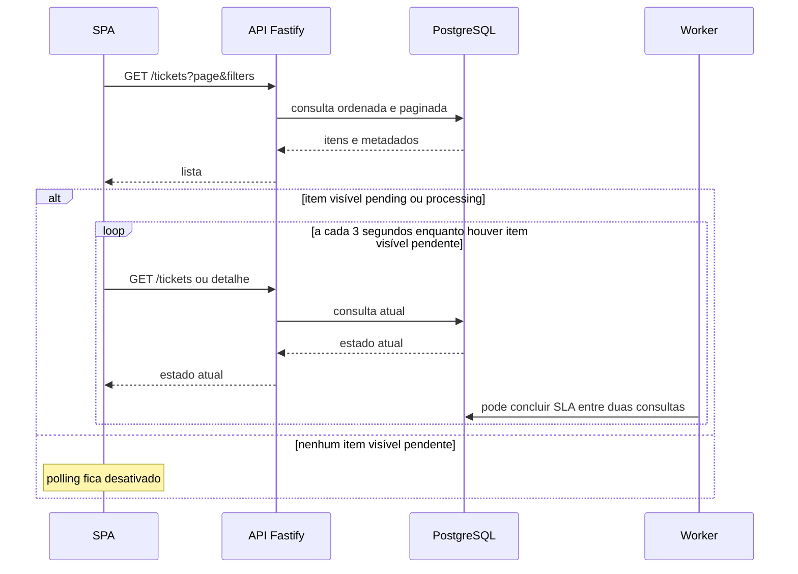
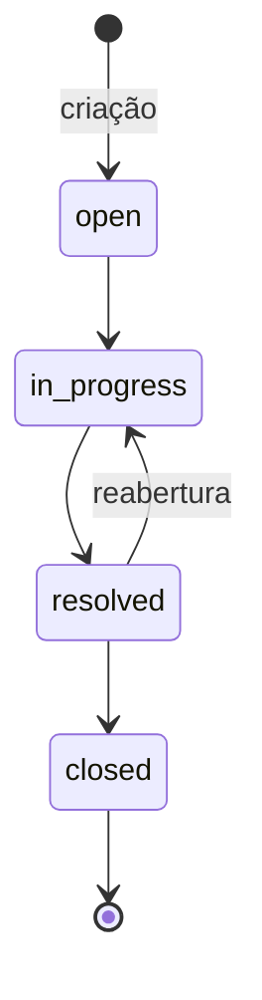
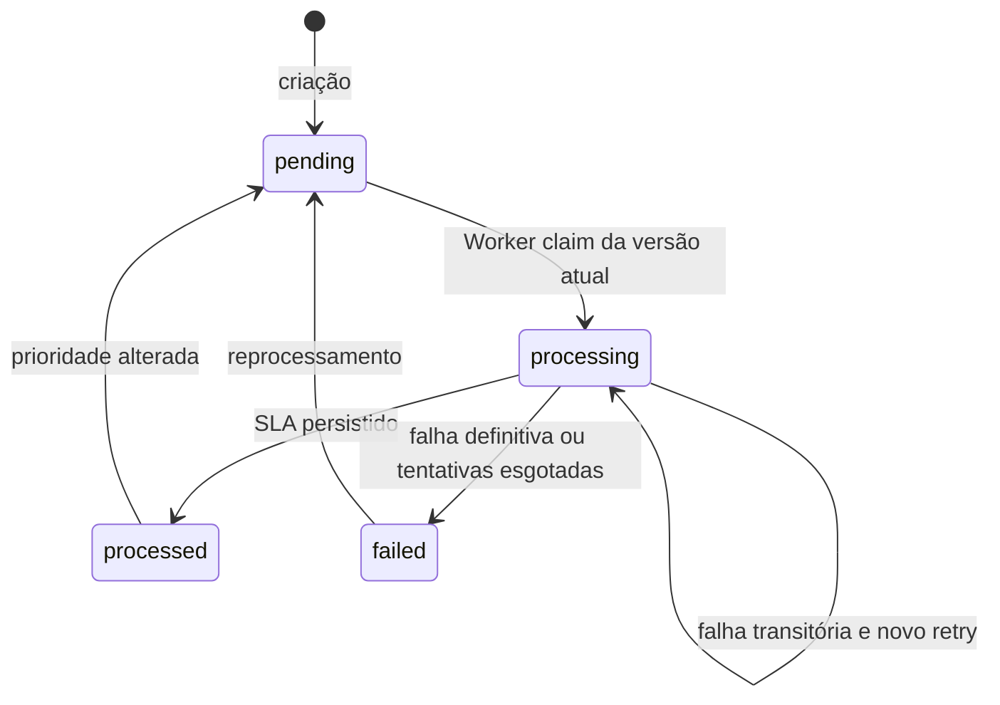
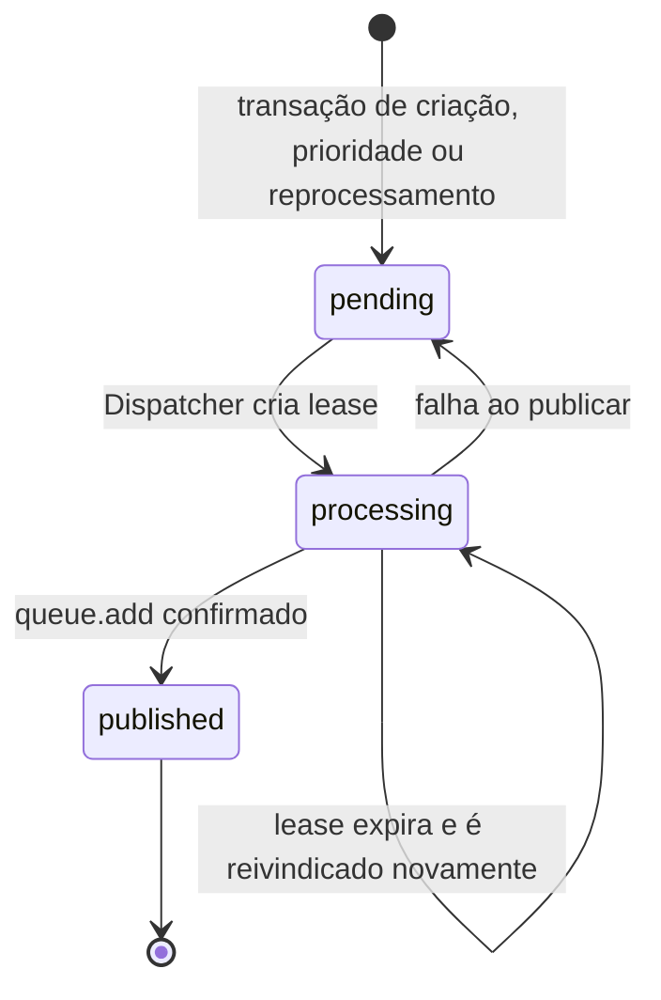

# Fluxos de execução — Gestão de Tickets InBot

**Público:** pessoas desenvolvedoras, avaliadores técnicos e avaliadores da solução.

Este documento explica o comportamento que dá significado à estrutura C4. O
catálogo completo de requests e responses está no código e seus testes; estes
diagramas cobrem os caminhos que alteram estado ou protegem consistência.

## Cobertura dos fluxos

| Fluxo               | Comportamento observado                                                |
| ------------------- | ---------------------------------------------------------------------- |
| Criação             | Validação, idempotência, transação e resposta imediata.                |
| Publicação e SLA    | Outbox, job determinístico, cache de feriados e persistência do prazo. |
| Falha e recuperação | Retry, falha definitiva e reprocessamento.                             |
| Condução do Ticket  | ETag/If-Match, conflito, status e prioridade.                          |
| Consulta da SPA     | Lista, detalhe e polling condicional do processamento.                 |

## Criação idempotente e intenção de processamento

A resposta `201` não espera Redis, Worker ou BrasilAPI. Se Redis estiver
indisponível, a intenção permanece no PostgreSQL para uma tentativa posterior.

## Publicação repetida e processamento idempotente

O `jobId` determinístico e o `claim` condicional não prometem entrega única;
eles tornam entrega repetida sem efeito de negócio duplicado.

## Retry, falha definitiva e reprocessamento

O reprocessamento só é aceito para um Ticket `failed` ou `pending`; um Ticket
`processed` não recebe trabalho duplicado. O operador deve usar o ETag atual,
pois reprocessar também incrementa a versão.

## Concorrência otimista em status e prioridade

Enviar o mesmo status ou a mesma prioridade é um _noop_: não gera histórico nem
incrementa a versão. A prioridade não pode ser alterada quando o Ticket está
fechado.

## Consulta e atualização sem recarga

O polling não é fonte de verdade nem altera estado. Ele apenas observa o valor
persistido pelo Worker e torna `pending`, `processing`, `processed` ou `failed`
visível sem F5.

## Máquinas de estado

### Status de atendimento

### Status de processamento do SLA

Os dois estados são independentes: resolver ou fechar o atendimento não apaga o
prazo calculado; mudar prioridade pode iniciar novo processamento sem mudar o
status de atendimento.

### Estado da mensagem Outbox

## Limites desta representação

- Operações de leitura, filtros e paginação são descritas pelo código e testes,
  não em sequências duplicadas.
- Não há garantia de entrega exatamente uma vez entre PostgreSQL e Redis; a
  garantia é intenção persistida e efeitos idempotentes.
- A BrasilAPI não participa de readiness. A indisponibilidade dela afeta o SLA,
  não a capacidade de consultar ou editar Tickets.
